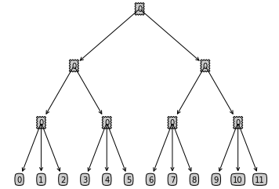

title: Formulae Auto-Derivation for Nested Logit Models
date: 2020-11-29
category: Python, Econometrics
tags: SymPy, Nested Logit

This file uses the Symbolic Python (SymPy) package to derive the elasticity formulae for Nested Logit Models. SymPy is a Python library for symbolic mathematics. It aims to become a full-featured computer algebra system (CAS) while keeping the code as simple as possible in order to be comprehensible and easily extensible. More details about SymPy can be found on the SymPy package main page: [SymPy](https://www.sympy.org/en/index.html).

To use the SymPy package, we first have to import the SymPy package as follows. Note that we also include the `init_printing()` function to enable the pretty print which is particularly useful when we are printing a large amount of mathematical formulae.


```python
#### Import libraries
from sympy import *
import sys
init_printing()
```

Before doing the real math, first let us familiarize ourselves with the basic functions in SymPy that we are going to use. Before using a symbolic mathematical variable, we have to define the variable using `Symbol()`. Then we can go on and doing simple mathematics just like how we will do them in Python.


```python
# Define new symbolic mathematical variables and add them up
a = Symbol('a')
b = Symbol('b')
a + b
```


Another helpful function in SymPy that we are going to use a lot is taking the derivative, `diff()`.


```python
# Taking the derivative of a mathematical expression with respect to the varaible a
diff(sin(a + b) - (a + b) ** (a + b), a)
```


The last function that we are going to use heavily later is the subs() method of a SymPy expression. We will use this function to substitute certain part of the express with something that is more readable and understandable to human eyes.


```python
# Subtitute (a + b) with t to simplify the expression
t = Symbol('t')
diff(sin(a + b) - (a + b) ** (a + b), a).subs(a + b, t)
```


Next, let's set up our model by specifying a few basic parameters in the model.


```python
#### Settings
number_end_group = 3  # This is the number of vehicles in each end group of our tree
number_splits_non_end_node = 2  # This is the number of splits for each node if the node is not on the last two levels
depth_of_tree = 3  # This is the depth of our tree
```

From the above settings, we build up a tree with the following structre.


```python
import matplotlib.pyplot as plt
%matplotlib inline

decision_node = dict(boxstyle="sawtooth", fc="0.8")
leaf_node = dict(boxstyle="round4", fc="0.8")
arrow_args = dict(arrowstyle="<-")


def get_leaf_num(tree):
    leaf_num = 0
    for key in tree.keys():
        if type(tree[key]).__name__ == "dict":
            leaf_num +=get_leaf_num(tree[key])
        else:
            leaf_num +=1
    return leaf_num


def get_tree_depth(tree):
    depth = 0
    for key in tree.keys():
        if type(tree[key]).__name__ == "dict":
            thisdepth = 1+ get_tree_depth(tree[key])
        else:
            thisdepth = 1
        if thisdepth>depth: depth = thisdepth
    return depth


def plotNode(nodeTxt, centerPt, parentPt, nodeType):
    createPlot.ax1.annotate(nodeTxt, xy=parentPt, xycoords='axes fraction',
                            xytext=centerPt, textcoords='axes fraction',
                            va="center", ha="center", bbox=nodeType, arrowprops=arrow_args)

    
def plotTree(myTree, parentPt, nodeTxt):
    numLeafs = get_leaf_num(myTree)
    depth = get_tree_depth(myTree)
    firstStr = list(myTree.keys())[0]
    cntrPt = (plotTree.xOff + (1.0 + float(numLeafs)) / 2.0 / plotTree.totalW, plotTree.yOff)
    plotNode(firstStr, cntrPt, parentPt, decision_node)
    secondDict = myTree[firstStr]
    plotTree.yOff = plotTree.yOff - 1.0 / plotTree.totalD
    for key in myTree.keys():
        if type(myTree[key]).__name__ == 'dict':
            plotTree(myTree[key], cntrPt, str(key))
        else:
            plotTree.xOff = plotTree.xOff + 1.0 / plotTree.totalW
            plotNode(myTree[key], (plotTree.xOff, plotTree.yOff), cntrPt, leaf_node)
    plotTree.yOff = plotTree.yOff + 1.0 / plotTree.totalD


def createPlot(inTree):
    fig = plt.figure(1, facecolor='white')
    fig.clf()
    axprops = dict(xticks=[], yticks=[])
    createPlot.ax1 = plt.subplot(111, frameon=False, **axprops)
    plotTree.totalW = float(get_leaf_num(inTree))
    plotTree.totalD = float(get_tree_depth(inTree))
    plotTree.xOff = -0.5 / plotTree.totalW
    plotTree.yOff = 1.0
    plotTree(inTree, (0.5, 1.0), '')
    plt.show()


def create_dict(level):
    global count, number_end_group, number_splits_non_end_node, depth_of_tree
    if level == depth_of_tree - 1:
        dic = dict()
        for i in range(number_end_group):
            dic[str(i)] = count
            count += 1
        return dic
    else:
        dic = dict()
        for i in range(number_splits_non_end_node):
            name = str(i)
            dic[str(i)] = create_dict(level+1)
        return dic

    
count = 0
createPlot(create_dict(0))
```





Now that we finished setting up our model we can start calculating the formulae of interest. Let's first review the formulae for the share and elasticities in the Nested Logit Model. The share of one end node in the Nested Logit Model is


### Self-elasticity
The self-elasticity of the node is


and the cross-elasticity of the node with another node within the same group in the second to last layer is


```python
# Basic elements for calculation
total_end_nodes = number_splits_non_end_node ** (depth_of_tree - 1) * number_end_group
for i in range(total_end_nodes):
    exec('p_%d = symbols("p_%d")' % (i, i))
total_theta = 0
for i in range(depth_of_tree):
    total_theta += number_splits_non_end_node ** i
for i in range(total_end_nodes):
    exec('v_%d = symbols("v_%d")' % (i, i))
for i in range(depth_of_tree):
    for j in range(number_splits_non_end_node ** i):
        exec('theta_%d_%d = symbols("theta_%d_%d")' % (i, j, i, j))
for i in range(depth_of_tree+1):
    exec('s_%d = symbols("s_%d")' % (i, i))
```


```python
# Intermediate sums in s
for i in range(total_end_nodes):
    exec('sum_exp_%d_%d = exp(v_%d / theta_%d_%d)' % (depth_of_tree, i, i, depth_of_tree-1, i // number_end_group))
    

for i in range(total_end_nodes // number_end_group):
    st = 'sum_%d_%d =' % (depth_of_tree-1, i)
    for j in range(i*number_end_group, i*number_end_group + number_end_group):
        st = st + ' exp(v_%d / theta_%d_%d) +' % (j, depth_of_tree-1, i)
    exec(st[:-1])
    exec('sum_exp_%d_%d = sum_%d_%d ** (theta_%d_%d / theta_%d_%d)' % (depth_of_tree-1, i, depth_of_tree-1, i, depth_of_tree-1, i,
                                                                       depth_of_tree-2, i//number_splits_non_end_node))

for k in range(depth_of_tree-2, 0, -1):
    for i in range(number_splits_non_end_node ** k):
        st = 'sum_%d_%d =' % (k, i)
        for j in range(i*number_splits_non_end_node, (i+1)*number_splits_non_end_node):
            st = st + ' sum_exp_%d_%d +' % (k+1, j)
        exec(st[:-1])
        exec('sum_exp_%d_%d = sum_%d_%d ** (theta_%d_%d / theta_%d_%d)' % (k, i, k, i, k, i,
                                                                       k-1, i//number_splits_non_end_node))

st = 'sum_0_0 ='
for j in range(number_splits_non_end_node):
    st = st + ' sum_exp_%d_%d +' % (1, j)
exec(st[:-1])
exec('sum_exp_0_0 = sum_0_0 ** (theta_0_0)')
```


```python
# Calculate final expression for s
exec('s = sum_exp_%d_0 / (1 + sum_0_0 ** theta_0_0)' % depth_of_tree)
for i in range(depth_of_tree):
    exec('s = s / sum_%d_0 * sum_exp_%d_0' % (i, i))
```


```python
s
```


```python
#### Deriving the own-elasticity formular
s_diff = diff(s, v_0)
```


```python
s_simp = s_diff.subs(sum_exp_0_0 / (1+sum_exp_0_0), s_0)
for i in range(depth_of_tree):
    exec('s_simp = s_simp.subs(sum_exp_%d_0 / sum_%d_0, s_%d / s_%d)' % (i+1, i, i+1, i))
s_simp
```


```python
beta = symbols('beta')
p_0 = symbols('p_0')
exec('output = p_0 * beta * expand(s_simp / s_%d)' % depth_of_tree)
output
```


### Cross-elasticity
```python
#### Deriving the cross-elasticity formular for vehicles in the same make_region (second to the lowest level)
level_of_similarity = 0 # starts from 0
diff_node = total_end_nodes // number_splits_non_end_node ** level_of_similarity - 1
exec('s_diff_v_x = diff(s, v_%d)' % diff_node)
s_v_0 = s
s_simp = s_diff_v_x.subs(sum_exp_0_0 / (1+sum_exp_0_0), s_0)
s_v_0 = s_v_0.subs(sum_exp_0_0 / (1+sum_exp_0_0), s_0)
for i in range(level_of_similarity):
    exec('s_simp = s_simp.subs(sum_exp_%d_0 / sum_%d_0, s_%d / s_%d)' % (i+1, i, i+1, i))
    exec('s_v_0 = s_v_0.subs(sum_exp_%d_0 / sum_%d_0, s_%d / s_%d)' % (i+1, i, i+1, i))
for i in range(level_of_similarity, depth_of_tree):
    exec('s_simp = s_simp.subs(sum_exp_%d_%d / sum_%d_%d, s_%d / s_%d)' % (i+1, diff_node // number_end_group // number_splits_non_end_node ** (depth_of_tree-i-2),
                                                                           i, diff_node // number_end_group // number_splits_non_end_node ** (depth_of_tree-i-1), i+1, i))
    exec('s_v_0 = s_v_0.subs(sum_exp_%d_%d / sum_%d_%d, s_%d / s_%d)' % (i+1, diff_node // number_end_group // number_splits_non_end_node ** (depth_of_tree-i-2),
                                                                           i, diff_node // number_end_group // number_splits_non_end_node ** (depth_of_tree-i-1), i+1, i))
exec('s_simp = s_simp.subs(exp(v_%d/theta_%d_%d) / sum_%d_%d, s_%d / s_%d)' % (diff_node, depth_of_tree-1, diff_node // number_end_group,
                                                                           depth_of_tree-1, diff_node // number_end_group, depth_of_tree,
                                                                              depth_of_tree-1))
exec('s_v_0 = s_v_0.subs(exp(v_%d/theta_%d_%d) / sum_%d_%d, s_%d / s_%d)' % (diff_node, depth_of_tree-1, diff_node // number_end_group,
                                                                           depth_of_tree-1, diff_node // number_end_group, depth_of_tree,
                                                                              depth_of_tree-1))
beta = Symbol('beta')
p_1 = Symbol('p_1')
beta * p_1 * simplify(s_simp / s_v_0)
```


```python
# Cross-elasticity with outside option
outside_s = 1 - sum_exp_0_0 / (1+sum_exp_0_0)
s_diff_v_0 = diff(outside_s, v_0)
s_simp = s_diff_v_0 / outside_s
s_simp = s_simp.subs(sum_exp_0_0 / (1+sum_exp_0_0), s_0)
for i in range(depth_of_tree):
    exec('s_simp = s_simp.subs(sum_exp_%d_0 / sum_%d_0, s_%d / s_%d)' % (i+1, i, i+1, i))
beta = Symbol('beta')
p_1 = Symbol('p_1')
beta * p_1 * simplify(s_simp)
```


