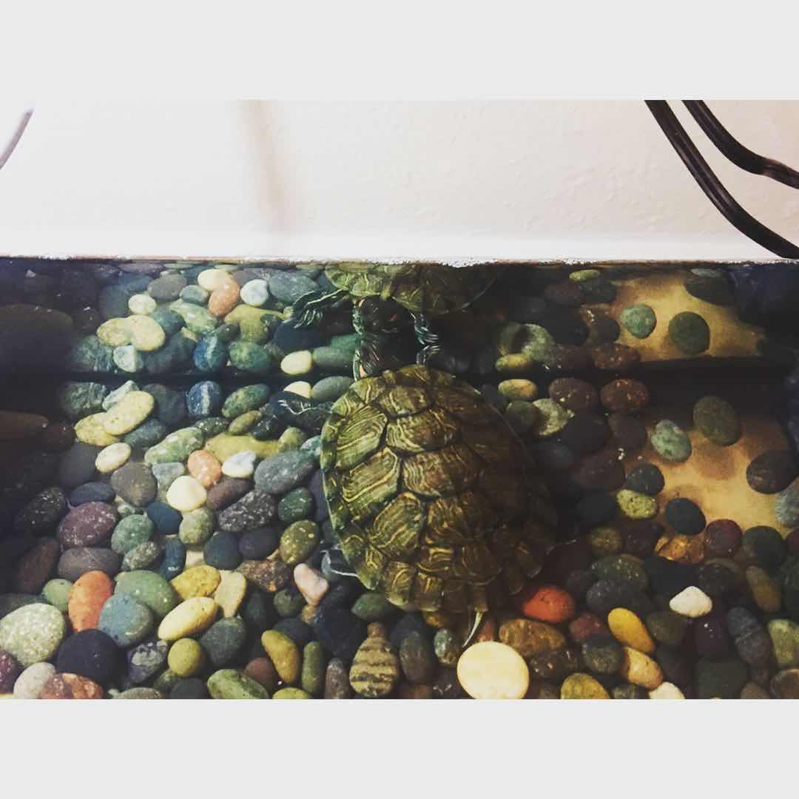

Title: Things One Should Know before Having a Pet Turtle
Date: 04/27/2020
Category: Turtle

I got my one-month-old red-eared turtle from PetSmart yesterday and learned a lot from the staff there.
Keeping a pet turtle actually needs more work and preparation than I initially expected. Here is a summary of the things 
I learned and I believe everyone should know when considering having a pet turtle. 

If you are planning to keep your turtle indoor, there are a couple essential accessories that you
will need:

A red-eared turtle and other popular turtle species for pet can usually grow up to 12 inches in full length and will need a water tank of at least 40 gallons (36 3/16 x 18 1/4 x 16 15/16 inches) which
may take up quite some space for people living in small apartments like me.

Turtles need to be exposed to enough UVA and UVB every day to stimulate the growth of their bones and shells.
A wild turtle would naturally get them by basking under then sun. However, an indoor turtle would need to have a
dedicated light to generate UVA and UVB for them. In winter, it is usually better to have a heat light in addition to the
UVA&UVB light in order to create a suitable basking temperature for the turtles.

Another essential is the water cleaner. It is used to keep the water clean and the turtle healthy. I would also recommend
getting a pump or a water tank with a drain since we would be changing the water for turtles weekly.

It is better to take these things into account when considering buying a turtle. It may be more work than expected. 
Luckily, it is likely that we can get all those accessories from a pet store selling turtles for under 100 dollars.

Lastly, a photo of my baby turtle exploring its new home.

